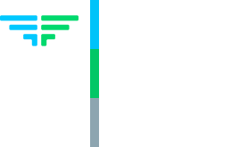

# CTF Amt (FluxBot vPublic)

This is the public version of FluxBot, a Discord bot for CTF teams.\
Made by [FluxFingers](https://fluxfingers.net/).

## Features
- Automagically creates categories and channels for CTF and challenges
- Manage self-assignable CTF-specific roles ("Player" role required so you can vet who gets access)
- Creates pads for each challenge
- Mark channel/challenge as solved

## Deployment
You need a [HedgeDoc](https://hedgedoc.org/) (V1) instance running\
Also please create a new Discord bot and invite it to your server.

1. Copy `.env.example` to `.env` and fill in the values
2. `docker-compose up`
3. Profit

## License
MIT

