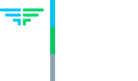

# CTF Amt (FluxBot vPublic)



This is the public version of FluxBot, a Discord bot for CTF teams.\
Made by [FluxFingers](https://fluxfingers.net/).

## Features
- Automagically creates categories and channels for CTFs and challenges
- Manage self-assignable CTF-specific roles (`PLAYER_ROLE` required so you can vet who gets access)
- Creates a [HedgeDoc](https://hedgedoc.org/) pad for each challenge
- Mark a challenge as solved (`/solved`) — random emote reaction, channel moves to the bottom and is renamed `solved-…`
- Remove a finished CTF (`/delete`) — wipes the category, channels and role after a confirmation prompt
- *(optional)* CTFtime feed: polls ctftime.org every 4 minutes and posts an embed per upcoming CTF in a dedicated channel, with a 👍 "Interested" button and a 🗑️ remove-from-feed button
- English UI by default, optional German via `BOT_LANG=de`

## Deployment
You need a [HedgeDoc](https://hedgedoc.org/) (v1) instance running.\
Also please create a new Discord bot and invite it to your server.

1. Copy `.env.example` to `.env` and fill in the values
2. `docker compose up --build`
3. Profit

Do not forget to enable **Server Members Intent** and **Message Content Intent** in the Bot section of the Discord Developer Portal.

The SQLite database (`fluxbot.db`) is stored under `BASE_PATH` (mounted to `./ctfamt-db` by `docker-compose.yml` by default).

### Optional CTFtime feed
Set `CTFTIME_FEED_CHANNEL` to a Discord channel ID and the bot will keep `CTFTIME_FEED_AMOUNT` upcoming CTFs posted in that channel, updating every 4 minutes. Leave it unset to disable the feature entirely.

### Re-registering slash commands
Commands are registered once on first run. To force a re-registration (for example after upgrading), start the bot once with `--setup`:

```sh
node dist/main.js --setup
```

or uncomment the `command:` line in `docker-compose.yml`.

## License
MIT
